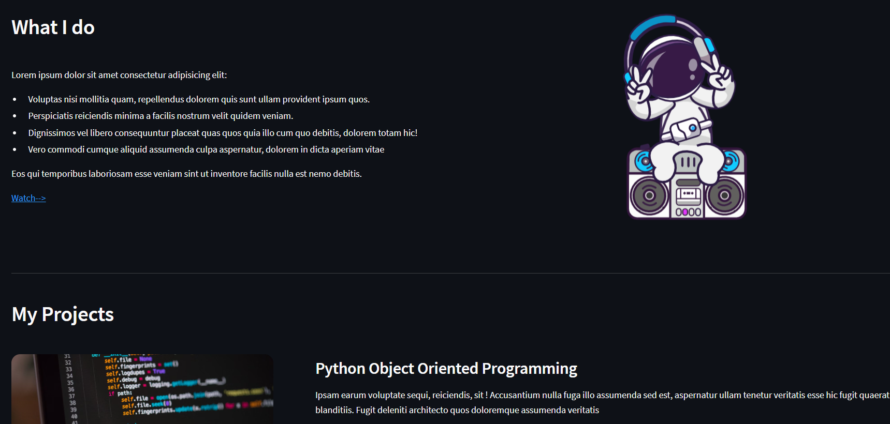

# My First Webpage using only Python
### Using Streamlit and Pillow libraries of Python ###
---

[Take me to the App](https://my-first-page.streamlit.app/)

---

> Or you just wanna check out the results..??

---

>The form available at the end of the webpage is completely functional.

>ALthough, I used an API of [formsubmit.co](https://formsubmit.co/) to achieve that functionality.

---
